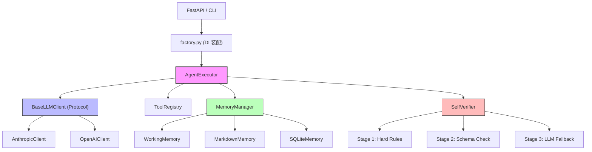

# Design Document — MiAO AI Personal Agent

## Overview

MiAO AI 是一个双 Provider（Anthropic + OpenAI）Personal AI Agent，核心设计原则是 **Contract-First + Provider 中立**。所有模块通过内部中立格式 `CanonicalMessage` 通信，实现真正的开闭原则。

## Steering Document Alignment

### Technical Standards (tech.md)
- Python 3.11+ / FastAPI / raw SDK（无 LangChain）
- asyncio 全异步架构，同步 tool 自动 to_thread 卸载
- pydantic v2 做数据验证和配置管理

### Project Structure (structure.md)
- 六层目录：`llm/` → `tools/` → `memory/` → `verification/` → `agent/` → `main.py`
- 单向依赖，共享类型在 `app/llm/base.py`
- 测试文件 3 个，映射核心模块

## Code Reuse Analysis

### Existing Components to Leverage
- **pydantic BaseModel**：所有内部数据模型（CanonicalMessage, ToolSpec, ToolCall）
- **FastAPI Depends**：DI 注入 agent 实例到路由
- **anthropic SDK**：`client.messages.create()` 原生 tool_use 支持
- **openai SDK**：`client.chat.completions.create()` function calling 支持

### Integration Points
- **LLM Provider APIs**：双向翻译层（marshal/unmarshal）在各自 Client 内部
- **SQLite**：aiosqlite 异步驱动，`messages` 表 + `facts` 表
- **File System**：`profile.json` + `learned_facts.md`，atomic write 保护

---

## Architecture

### 核心设计模式



### 模块化设计原则
- **Single File Responsibility**：每个文件只处理一个关注点
- **Component Isolation**：Protocol/ABC 定义接口，具体实现完全隔离
- **Service Layer Separation**：LLM 通信 / 工具执行 / 数据持久化 / 校验 各自独立
- **DI via Factory**：`factory.py` 集中装配，路由层不直接 import 具体实现

---

## Components and Interfaces

### CanonicalMessage（类型契约核心）

```python
class CanonicalMessage(BaseModel):
    role: Literal["user", "assistant", "tool_result"]
    content: str | None = None
    tool_calls: list[ToolCall] | None = None
    tool_call_id: str | None = None        # ← 中立命名，禁止 tool_use_id
```

- **Purpose**: 跨 Provider 的统一消息格式
- **Interfaces**: 所有 Client 必须实现 `marshal(canonical → provider)` + `unmarshal(provider → canonical)`
- **Dependencies**: pydantic v2

### BaseLLMClient（Provider 接口）

```python
class BaseLLMClient(Protocol):
    async def chat(
        self,
        messages: list[CanonicalMessage],
        tools: list[ToolSpec] | None = None,
    ) -> CanonicalMessage: ...
```

- **Purpose**: 定义 LLM Provider 通信契约
- **Implementations**: `AnthropicClient`, `OpenAIClient`
- **Dependencies**: 各自的 SDK

### ToolRegistry

- **Purpose**: 工具注册 + 执行 + 同步/异步自动判断
- **Key Logic**: `inspect.iscoroutinefunction(fn)` → 同步则 `asyncio.to_thread` 包裹
- **Interface**: `register(name, fn, spec)` / `execute(name, args) → str`

### MemoryManager

- **Purpose**: 三层记忆编排
- **Key Interface**: `get_context(conv_id) → tuple[str, list[CanonicalMessage]]`
- **Key Logic**: `after_turn()` 中 fact extraction 必须 `asyncio.create_task`（不 await）

### SelfVerifier

- **Purpose**: 三层校验，确保回答准确性
- **Key Constraint**: `verify()` 必须在主链路 `await` 阻塞（提速靠 Stage 1/2 短路 + Stage 3 抽样）

### RepeatedFailureDetector

- **Purpose**: 检测连续相同工具调用失败，注入纠偏
- **Key Constraint**: 按 `conv_id` 分桶（不是 AgentExecutor 级别共享）

---

## Data Models

### SQLite DDL

```sql
-- messages 表
CREATE TABLE IF NOT EXISTS messages (
    id INTEGER PRIMARY KEY AUTOINCREMENT,
    conversation_id TEXT NOT NULL,
    role TEXT NOT NULL,
    content TEXT,
    tool_calls TEXT,           -- JSON serialized
    tool_call_id TEXT,
    created_at TIMESTAMP DEFAULT CURRENT_TIMESTAMP
);
CREATE INDEX idx_messages_conv ON messages(conversation_id);

-- facts 表
CREATE TABLE IF NOT EXISTS facts (
    id INTEGER PRIMARY KEY AUTOINCREMENT,
    key TEXT NOT NULL,
    value TEXT NOT NULL,
    source TEXT,               -- 'user_stated' | 'llm_extracted'
    confidence REAL DEFAULT 1.0,
    created_at TIMESTAMP DEFAULT CURRENT_TIMESTAMP,
    updated_at TIMESTAMP DEFAULT CURRENT_TIMESTAMP
);
CREATE UNIQUE INDEX idx_facts_key ON facts(key);
```

### profile.json Schema

```json
{
  "preferred_name": {
    "value": "Akarin",
    "type": "string"
  },
  "preferred_language": {
    "value": "zh-CN",
    "type": "enum",
    "values": ["zh-CN", "en-US", "ja-JP"]
  },
  "wake_up_time": {
    "value": "08:00",
    "type": "time",
    "tolerance": "30min"
  }
}
```

---

## Error Handling

### Error Scenarios

1. **LLM API 调用失败**
   - **Handling**: 捕获异常，返回友好错误消息，不冒泡到主循环
   - **User Impact**: 用户看到"抱歉，暂时无法处理"提示

2. **Tool 执行异常**
   - **Handling**: 捕获异常，将错误信息作为 tool_result 返回给 LLM 继续推理
   - **User Impact**: Agent 自动调整策略，用户无感知

3. **文件写入中途 crash**
   - **Handling**: atomic write 保证原文件不被 truncate
   - **User Impact**: 最多丢失一次更新，不会数据损坏

4. **连续工具失败（幻觉循环）**
   - **Handling**: RepeatedFailureDetector 3 次后注入纠偏
   - **User Impact**: Agent 自动改变策略，避免死循环

---

## Testing Strategy

### Unit Testing（`test_tool_roundtrip.py`）
- 双 Provider 各跑一次完整 [user → tool_use → tool_result → end_turn]
- 单轮多 tool_calls 按 id 回填测试
- 同步 tool 不阻塞 Event Loop 测试

### Integration Testing（`test_memory.py`）
- 并发文件写入锁有效性（instance Lock vs 局部 Lock 鉴伪）
- Atomic write 故障注入（mock os.replace 抛异常）
- 多 conv_id 隔离测试

### Verification Testing（`test_verification.py`）
- Stage 1/2/3 各自触发路径
- revised_answer 持久化正确性
- 主链路顺序正确性（verify await 阻塞 + extraction fire-and-forget）
