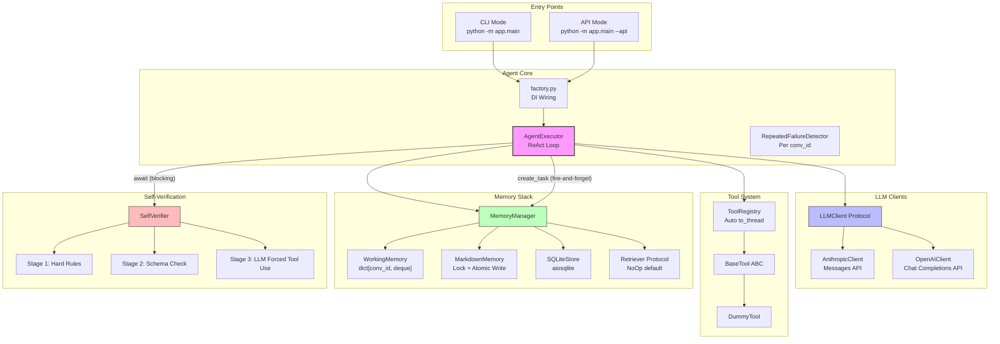

# Personal AI Agent

A modular, production-quality Personal AI Agent with Tool Use, Memory, and Self-Verification.

## Architecture



## Quick Start

```bash
# 1. Clone and setup
git clone <repo-url>
cd personal-ai-agent
python -m venv .venv
.venv/Scripts/activate  # Windows
# source .venv/bin/activate  # Linux/Mac

# 2. Install dependencies
pip install -r requirements.txt

# 3. Configure
cp .env.example .env
# Edit .env with your API keys

# 4. Run tests
pytest tests/ -v

# 5. Start CLI mode
python -m app.main

# 6. Or start API mode
python -m app.main --api
# Then: curl http://localhost:8000/health
```

## API Endpoints

| Method | Path | Description |
|--------|------|-------------|
| GET | `/health` | Health check |
| POST | `/chat` | Send message, get response |
| GET | `/memory` | View profile and facts |

### POST /chat

```json
{
  "message": "What's the weather in Tokyo?",
  "conversation_id": "optional-uuid"
}
```

## Design Decisions

1. **Honest Abstractions** — Every "provider-agnostic" claim has real tests proving both providers work. No `to_schema()` that secretly only works for one provider.

2. **Conv_id Isolation** — All stateful components (WorkingMemory, RepeatedFailureDetector) strictly partition by conversation_id. No global mutable state shared across conversations.

3. **3-Stage Verifier with Metadata Schema + Forced Tool Use + Sampling**
   - Stage 1: Deterministic tool_results hard rules
   - Stage 2: Structured profile validation with type-aware checks
   - Stage 3: LLM verification using **forced tool_choice** (not hopeful chat) + proactive sampling

4. **Async Safety by Default**
   - `asyncio.to_thread` for sync tool execution
   - `asyncio.Lock` (instance attribute) for file protection
   - Atomic write (`{path}.tmp` + `os.replace`) for crash safety

5. **Pluggable Retriever** — NoOpRetriever ships by default. Concrete RAG providers go in `memory/providers/` during Layer 2.

6. **Prompt-as-Config** — System prompt and extraction prompt live in `prompts/` directory as markdown files. Layer 1 ships with heuristic extraction; LLM-based extraction is Layer 2.

7. **DI via `app.state` + `factory.py`** — API mode stores agent on `app.state.agent` via FastAPI lifespan. Routes access via `request.app.state` — no module-level mutable globals. CLI scopes agent to function body.

8. **Single-User Assumption** — `profile.json` and `learned_facts.md` are global files for a single user. Multi-user requires `users/{user_id}/` scope refactoring.

## ⚠️ Multi-Worker Warning

`asyncio.Lock` only protects within a **single process**. If you deploy with multiple Uvicorn workers (`uvicorn --workers N`), or run CLI and API simultaneously, `MarkdownMemory` file writes will race. You MUST either:

- Use `--workers 1` (default)
- Add `filelock` (cross-process lock) to `MarkdownMemory`
- Disable `MarkdownMemory` in multi-worker deployments

## Trade-offs

1. **Mock Weather API vs Real API** — `WeatherTool` uses deterministic RNG seeded by city name instead of calling a real weather API. This gives consistent demo results without requiring external API keys during the challenge. The `_fetch_weather` method is designed as a single swap point for production integration.

2. **Heuristic Fact Extraction vs LLM Extraction** — Memory extraction uses pattern matching (e.g., "my name is X") instead of an LLM call. This avoids an extra API round-trip per turn and keeps `after_turn()` fast. The trade-off is lower extraction accuracy for complex statements.

3. **Single-File Notes vs Database Notes** — `NoteTool` stores notes as appended markdown lines in `user_notes.md` instead of SQLite rows. This keeps the demo simple and human-readable, but doesn't scale to thousands of notes or support search/filtering.

4. **Forced Tool Use in Stage 3 vs response_format** — The verifier forces LLM to call `submit_verification` tool instead of using `response_format: json_schema`. This works across both Anthropic (tool_choice) and OpenAI (tool_choice), whereas `response_format` has different semantics between providers.

5. **asyncio.Lock vs filelock** — MarkdownMemory uses `asyncio.Lock` (single-process only). For multi-worker deployments, this must be upgraded to `filelock` for cross-process safety. Documented in the Multi-Worker Warning section.

6. **Fire-and-forget Memory Persistence** — `after_turn()` runs as a background task to avoid blocking the response. The trade-off: if the process crashes between response delivery and persistence completion, that turn's memory update is lost. Acceptable for a personal agent where data loss is inconvenient but not catastrophic.

## What I Would Build Next

1. **Streaming SSE** — Add Server-Sent Events for token-by-token streaming
2. **LLM-based Fact Extraction** — Replace heuristic extraction with LLM using `prompts/memory_extract.md`
3. **FTS5 Search** — Add full-text search to SQLiteStore for better retrieval
4. **Conversation Summarization** — Auto-summarize long conversations to manage context window
5. **Multi-User Support** — Refactor to `users/{user_id}/` scope with user authentication

## Project Structure

```
personal-ai-agent/
├── app/
│   ├── main.py                 # Dual entry: CLI + FastAPI
│   ├── factory.py              # DI wiring
│   ├── config.py               # Settings + DEFAULT_MODELS
│   ├── api/routes.py           # POST /chat, GET /memory, GET /health
│   ├── agent/
│   │   ├── core.py             # AgentExecutor + RepeatedFailureDetector
│   │   └── verifier.py         # SelfVerifier: 3-stage pipeline
│   ├── llm/
│   │   ├── base.py             # CanonicalMessage + ToolSpec + Protocol
│   │   ├── anthropic_client.py # Full bidirectional translation
│   │   └── openai_client.py    # Chat Completions API only
│   ├── tools/
│   │   ├── base.py             # BaseTool ABC
│   │   ├── registry.py         # ToolRegistry + auto to_thread
│   │   └── dummy.py            # Smoke test tool
│   ├── memory/
│   │   ├── manager.py          # MemoryManager orchestrator
│   │   ├── working.py          # dict[conv_id, deque]
│   │   ├── markdown_store.py   # Lock + atomic write + metadata
│   │   ├── sqlite_store.py     # aiosqlite + ISO 8601
│   │   ├── retriever.py        # Protocol + NoOpRetriever
│   │   └── providers/          # Layer 2 RAG implementations
│   └── models/schemas.py       # API Pydantic models
├── prompts/                    # Prompt templates (markdown)
├── tests/                      # 3 test files, 26 test functions
├── memory/                     # Runtime data (gitignored)
└── README.md
```
