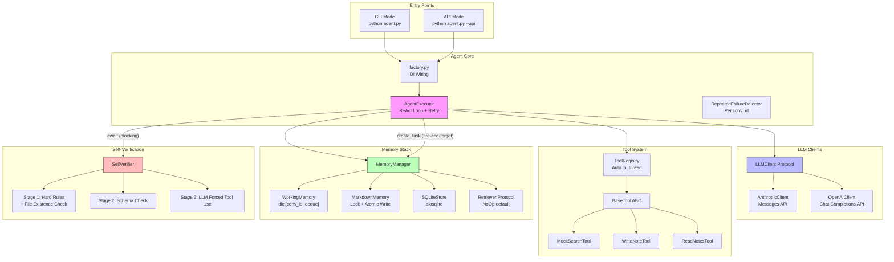

# Personal AI Agent

A modular, production-quality Personal AI Agent with Tool Use, Memory, Self-Verification, and Fault Injection.

## Architecture



## Quick Start

```bash
# 1. Clone and setup
git clone https://github.com/miaojan/challenge---785d37.git
cd challenge---785d37
python -m venv .venv
.venv/Scripts/activate  # Windows
# source .venv/bin/activate  # Linux/Mac

# 2. Install dependencies
pip install -r requirements.txt

# 3. Configure
cp .env.example .env
# Edit .env with your API keys

# 4. Run tests
pytest tests/ -v

# 5. Start CLI mode
python agent.py

# 6. Or start API mode
python agent.py --api
# Then: curl http://localhost:8000/health
```

## Fault Injection (INJECT_FAILURE)

The agent supports environment-variable-based fault injection to demonstrate retry and recovery behavior:

```bash
# Linux / macOS
INJECT_FAILURE=write_note python agent.py
INJECT_FAILURE=mock_search python agent.py

# Windows PowerShell
$env:INJECT_FAILURE="write_note"; python agent.py
$env:INJECT_FAILURE="mock_search"; python agent.py
```

When `INJECT_FAILURE` is set to a tool name, that tool will raise an exception on every call. The agent will:
1. **Retry** the tool call up to 2 times (logged visibly)
2. **Propagate** the ERROR result to the LLM if all retries fail
3. **Self-verify** via the 3-stage verifier — catching any hallucinated success
4. **Report honestly** to the user that the operation failed

## Tools

| Tool | Description | Fault Injectable |
|------|-------------|:---:|
| `mock_search` | Search simulated knowledge base | ✅ |
| `write_note` | Save note to disk (memory/notes/) | ✅ |
| `read_notes` | Read/filter saved notes | ❌ |

## API Endpoints

| Method | Path | Description |
|--------|------|-------------|
| GET | `/health` | Health check |
| POST | `/chat` | Send message, get response |
| GET | `/memory` | View profile and facts |

### POST /chat

```json
{
  "message": "What's the weather in Tokyo?",
  "conversation_id": "optional-uuid"
}
```

## Design Decisions

1. **Honest Abstractions** — Every "provider-agnostic" claim has real tests proving both providers work. No `to_schema()` that secretly only works for one provider.

2. **Conv_id Isolation** — All stateful components (WorkingMemory, RepeatedFailureDetector) strictly partition by conversation_id. No global mutable state shared across conversations.

3. **3-Stage Verifier with File Existence Check + Metadata Schema + Forced Tool Use + Sampling**
   - Stage 1: Deterministic tool_results hard rules + **file existence/non-empty check** for write operations
   - Stage 2: Structured profile validation with type-aware checks
   - Stage 3: LLM verification using **forced tool_choice** (not hopeful chat) + proactive sampling

4. **Tool-Level Retry (max 2)** — Failed tool calls are retried up to 2 times before the error is propagated. This is separate from the `RepeatedFailureDetector` (which catches infinite loops, not failures).

5. **Async Safety by Default**
   - `asyncio.to_thread` for sync tool execution
   - `asyncio.Lock` (instance attribute) for file protection
   - Atomic write (`{path}.tmp` + `os.replace`) for crash safety

6. **Pluggable Retriever** — NoOpRetriever ships by default. Concrete RAG providers go in `memory/providers/` during Layer 2.

7. **Prompt-as-Config** — System prompt and extraction prompt live in `prompts/` directory as markdown files. Layer 1 ships with heuristic extraction; LLM-based extraction is Layer 2.

8. **DI via `app.state` + `factory.py`** — API mode stores agent on `app.state.agent` via FastAPI lifespan. Routes access via `request.app.state` — no module-level mutable globals. CLI scopes agent to function body.

9. **Single-User Assumption** — `profile.json` and `learned_facts.md` are global files for a single user. Multi-user requires `users/{user_id}/` scope refactoring.

10. **Fault Injection via Constructor** — Each tool accepts `inject_failure: bool` in its constructor. `factory.py` reads `INJECT_FAILURE` env var and wires the flag to the targeted tool. This keeps injection logic out of the tool's core execute path.

## ⚠️ Multi-Worker Warning

`asyncio.Lock` only protects within a **single process**. If you deploy with multiple Uvicorn workers (`uvicorn --workers N`), or run CLI and API simultaneously, `MarkdownMemory` file writes will race. You MUST either:

- Use `--workers 1` (default)
- Add `filelock` (cross-process lock) to `MarkdownMemory`
- Disable `MarkdownMemory` in multi-worker deployments

## Trade-offs

1. **Mock Search vs Real API** — `MockSearchTool` uses a curated in-memory knowledge base instead of calling a real search API. This gives consistent demo results without requiring external API keys during the challenge. The tool is designed as a single swap point for production integration.

2. **Heuristic Fact Extraction vs LLM Extraction** — Memory extraction uses pattern matching (e.g., "my name is X") instead of an LLM call. This avoids an extra API round-trip per turn and keeps `after_turn()` fast.

3. **Single-File Notes vs Database Notes** — `WriteNoteTool` stores notes as individual markdown files in `memory/notes/`. This keeps the demo simple and human-readable, but doesn't scale to thousands of notes.

4. **Forced Tool Use in Stage 3 vs response_format** — The verifier forces LLM to call `submit_verification` tool instead of using `response_format: json_schema`. This works across both Anthropic and OpenAI, whereas `response_format` has different semantics between providers.

5. **asyncio.Lock vs filelock** — MarkdownMemory uses `asyncio.Lock` (single-process only). For multi-worker deployments, this must be upgraded to `filelock`.

6. **Fire-and-forget Memory Persistence** — `after_turn()` runs as a background task to avoid blocking the response.

## What I Would Build Next

1. **Streaming SSE** — Add Server-Sent Events for token-by-token streaming
2. **LLM-based Fact Extraction** — Replace heuristic extraction with LLM using `prompts/memory_extract.md`
3. **FTS5 Search** — Add full-text search to SQLiteStore for better retrieval
4. **Conversation Summarization** — Auto-summarize long conversations to manage context window
5. **Multi-User Support** — Refactor to `users/{user_id}/` scope with user authentication

## Project Structure

```
personal-ai-agent/
├── agent.py                    # Root entry point (python agent.py)
├── app/
│   ├── main.py                 # Dual entry: CLI + FastAPI
│   ├── factory.py              # DI wiring + INJECT_FAILURE routing
│   ├── config.py               # Settings + DEFAULT_MODELS
│   ├── api/routes.py           # POST /chat, GET /memory, GET /health
│   ├── agent/
│   │   ├── core.py             # AgentExecutor + ReAct + Retry (max 2)
│   │   └── verifier.py         # SelfVerifier: 3-stage + file check
│   ├── llm/
│   │   ├── base.py             # CanonicalMessage + ToolSpec + Protocol
│   │   ├── anthropic_client.py # Full bidirectional translation
│   │   └── openai_client.py    # Chat Completions API only
│   ├── tools/
│   │   ├── base.py             # BaseTool ABC
│   │   ├── registry.py         # ToolRegistry + auto to_thread
│   │   ├── mock_search.py      # Simulated knowledge base search
│   │   ├── write_note.py       # Persist notes to disk
│   │   ├── read_notes.py       # Read/filter saved notes
│   │   └── dummy.py            # Smoke test tool
│   ├── memory/
│   │   ├── manager.py          # MemoryManager orchestrator
│   │   ├── working.py          # dict[conv_id, deque]
│   │   ├── markdown_store.py   # Lock + atomic write + metadata
│   │   ├── sqlite_store.py     # aiosqlite + ISO 8601
│   │   ├── retriever.py        # Protocol + NoOpRetriever
│   │   └── providers/          # Layer 2 RAG implementations
│   └── models/schemas.py       # API Pydantic models
├── prompts/                    # Prompt templates (markdown)
├── tests/                      # Test suite
├── memory/                     # Runtime data (gitignored)
└── README.md
```
