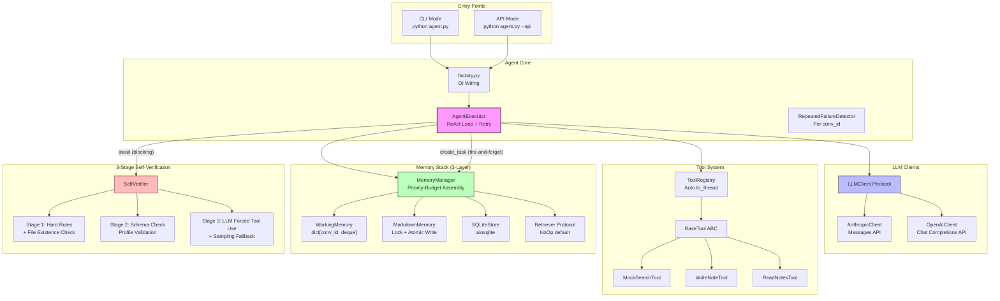

# MIA Agent — Personal AI Agent

A modular, production-quality Personal AI Agent with **ReAct Loop**, **3-Stage Self-Verification**, **3-Layer Memory Stack**, and **Fault Injection** testing.

Built from scratch without LangChain/LlamaIndex — hand-written ReAct engine with full control over the reasoning loop.

## Core Features

- 🧠 **Hand-written ReAct Engine** — Independent Reasoning + Acting loop with tool-level retry (max 2) and `RepeatedFailureDetector` (hash-based hallucination loop detection)
- ✅ **3-Stage Self-Verification Pipeline** — Deterministic hard rules → Profile schema validation → LLM forced-tool-use sampling fallback
- 💾 **3-Layer Memory Management** — WorkingMemory (session) → Markdown persistent (profile + facts) → SQLite structured store, with priority-budget context assembly
- 🔍 **Dual Fact Extraction** — LLM-based extraction (`_extract_facts_llm`) + heuristic fallback (`_extract_facts_heuristic`), fire-and-forget async persistence
- 🏭 **DI Factory Pattern** — `build_agent()` pure function assembly, zero global mutable state, `conv_id` strict isolation
- 🔌 **Dual Entry Points** — CLI interactive mode + FastAPI API mode with `--api` flag, lifespan DI injection
- 💉 **Fault Injection** — Environment variable based tool failure injection for demonstrating retry and recovery behavior

## Architecture



## Quick Start

```bash
# 1. Clone and setup
git clone https://github.com/Akarin-Akari/MIA_AI.git
cd MIA_AI
python -m venv .venv
.venv/Scripts/activate  # Windows
# source .venv/bin/activate  # Linux/Mac

# 2. Install dependencies
pip install -r requirements.txt

# 3. Configure
cp .env.example .env
# Edit .env with your API keys

# 4. Run tests
pytest tests/ -v

# 5. Start the Application (Recommended: Frontend Mode)
# This will start the FastAPI backend and serve the Web UI at http://localhost:8000
python agent.py --api

# 6. Or start in CLI mode
python agent.py
```

## 3-Stage Self-Verification Pipeline

The verification pipeline runs **synchronously after every agent turn**, ensuring response quality:

| Stage | Method | Description |
|:-----:|--------|-------------|
| **Stage 1** | Deterministic Hard Rules | Check tool_results consistency + file existence/non-empty for write operations |
| **Stage 2** | Profile Schema Validation | Type-aware structured check against `profile.json` metadata |
| **Stage 3** | LLM Forced Tool Use + Sampling | LLM verification using `forced tool_choice` (not hopeful chat) + proactive sampling fallback |

If any stage fails, the agent appends a correction message and re-generates the response.

## 3-Layer Memory Management

| Layer | Storage | Lifecycle | Purpose |
|:-----:|---------|-----------|---------|
| **Working** | `dict[conv_id, deque]` | Session | Short-term conversation context |
| **Markdown** | `profile.json` + `learned_facts.md` | Persistent | User profile + extracted facts, atomic write with `asyncio.Lock` |
| **SQLite** | `aiosqlite` | Persistent | Structured interaction history, ISO 8601 timestamps |

### Priority-Budget Context Assembly

Context is assembled with strict priority ordering to fit within token limits:
- **P0**: System prompt (always included)
- **P1**: User profile from Markdown store
- **P2**: RAG retrieval results (60% of remaining budget)
- **P3**: Extracted facts (40% of remaining budget)

### Dual Fact Extraction

Memory extraction uses a two-path strategy:
1. **LLM-based extraction** (`_extract_facts_llm`) — Structured extraction via LLM with dedicated prompts
2. **Heuristic fallback** (`_extract_facts_heuristic`) — Pattern matching (e.g., "my name is X") when LLM extraction fails

Both paths run as **fire-and-forget** async tasks (`create_task`) to avoid blocking the response.

## Fault Injection

```bash
# Linux / macOS
INJECT_FAILURE=write_note python agent.py
INJECT_FAILURE=mock_search python agent.py

# Windows PowerShell
$env:INJECT_FAILURE="write_note"; python agent.py
$env:INJECT_FAILURE="mock_search"; python agent.py
```

When `INJECT_FAILURE` is set to a tool name, that tool will raise an exception on every call. The agent will:
1. **Retry** the tool call up to 2 times (logged visibly)
2. **Detect loops** via `RepeatedFailureDetector` (hash-based dedup per `conv_id`)
3. **Propagate** the ERROR result to the LLM if all retries fail
4. **Self-verify** via the 3-stage verifier — catching any hallucinated success
5. **Report honestly** to the user that the operation failed

## Tools

| Tool | Description | Fault Injectable |
|------|-------------|:---:|
| `mock_search` | Search simulated knowledge base | ✅ |
| `write_note` | Save note to disk (memory/notes/) | ✅ |
| `read_notes` | Read/filter saved notes | ❌ |

## API Endpoints

| Method | Path | Description |
|--------|------|-------------|
| GET | `/health` | Health check |
| POST | `/chat` | Send message, get response |
| GET | `/memory` | View profile and facts |

## Design Decisions

1. **Honest Abstractions** — Every "provider-agnostic" claim has real tests proving both providers work.

2. **Conv_id Isolation** — All stateful components (WorkingMemory, RepeatedFailureDetector) strictly partition by `conversation_id`. No global mutable state shared across conversations.

3. **Tool-Level Retry (max 2)** — Failed tool calls are retried up to 2 times before the error is propagated. Separate from `RepeatedFailureDetector` (which catches infinite loops via hash dedup).

4. **Async Safety by Default**
   - `asyncio.to_thread` for sync tool execution
   - `asyncio.Lock` (instance attribute) for file protection
   - Atomic write (`{path}.tmp` + `os.replace`) for crash safety

5. **DI via `app.state` + `factory.py`** — API mode stores agent on `app.state.agent` via FastAPI lifespan. CLI scopes agent to function body. Zero module-level mutable globals.

6. **Prompt-as-Config** — System prompt and extraction prompt live in `prompts/` directory as markdown files.

## Project Structure

```
MIA_AI/
├── agent.py                    # Root entry point (python agent.py)
├── app/
│   ├── main.py                 # Dual entry: CLI + FastAPI (--api flag)
│   ├── factory.py              # DI wiring + INJECT_FAILURE routing
│   ├── config.py               # Settings + DEFAULT_MODELS
│   ├── api/routes.py           # POST /chat, GET /memory, GET /health
│   ├── agent/
│   │   ├── core.py             # AgentExecutor + ReAct Loop + Retry (max 2)
│   │   └── verifier.py         # SelfVerifier: 3-stage pipeline
│   ├── llm/
│   │   ├── base.py             # CanonicalMessage + ToolSpec + Protocol
│   │   ├── anthropic_client.py # Full bidirectional translation
│   │   └── openai_client.py    # Chat Completions API
│   ├── tools/
│   │   ├── base.py             # BaseTool ABC
│   │   ├── registry.py         # ToolRegistry + auto to_thread
│   │   ├── mock_search.py      # Simulated knowledge base search
│   │   ├── write_note.py       # Persist notes to disk
│   │   ├── read_notes.py       # Read/filter saved notes
│   │   └── dummy.py            # Smoke test tool
│   ├── memory/
│   │   ├── manager.py          # MemoryManager (3-layer + priority budget)
│   │   ├── working.py          # WorkingMemory: dict[conv_id, deque]
│   │   ├── markdown_store.py   # Lock + atomic write + metadata
│   │   ├── sqlite_store.py     # aiosqlite + ISO 8601
│   │   ├── retriever.py        # Protocol + NoOpRetriever
│   │   └── providers/          # RAG provider implementations
│   └── models/schemas.py       # API Pydantic models
├── prompts/                    # Prompt templates (markdown)
├── tests/                      # Test suite
├── memory/                     # Runtime data (gitignored)
└── README.md
```

## License

MIT
