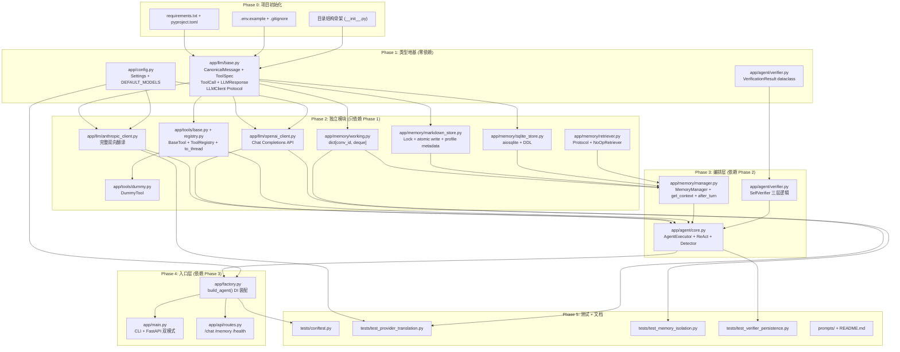

# MiAO AI — Layer 1 脚手架搭建实施计划

## 目标

根据 `docs/脚手架prompt_v3.md`（v3.2）蓝本，在 `F:\MIAO_AI` 下搭建完整的 Layer 1 通用骨架代码，通过全部 22 项 Acceptance Criteria。

## 依赖关系分析 — 地基优先



## Phase 0 — 项目初始化（地基中的地基）

> [!IMPORTANT]
> 先安装 FastAPI + 依赖，确保 Python 环境可用。

### [NEW] `requirements.txt`
- fastapi, uvicorn, anthropic, openai, pydantic, pydantic-settings
- aiosqlite, aiofiles, python-dotenv
- pytest, pytest-asyncio

### [NEW] `pyproject.toml`
- 项目元数据 + pytest 配置（`asyncio_mode = "auto"`）

### [NEW] `.env.example`
- `LLM_PROVIDER`, `ANTHROPIC_API_KEY`, `OPENAI_API_KEY`, 等占位

### [NEW] `.gitignore`
- `memory/`, `.env`, `__pycache__/`, `*.db`, `.pytest_cache/`

### [NEW] 目录骨架
- 所有 `__init__.py`（`app/`, `app/llm/`, `app/tools/`, `app/memory/`, `app/memory/providers/`, `app/agent/`, `app/api/`, `app/models/`, `tests/`）
- `memory/.gitkeep`
- `prompts/system.md`, `prompts/verifier.md`, `prompts/memory_extract.md`（占位）

---

## Phase 1 — 类型地基（零外部依赖，纯数据定义）

> [!IMPORTANT]
> 这是整个项目的基石。所有后续模块都 import 这些类型。必须最先完成且不能出错。

### [NEW] `app/llm/base.py`
- `ToolSpec`（dataclass）：name, description, parameters
- `ToolCall`（dataclass）：id, name, input
- `LLMResponse`（dataclass）：content, tool_calls, stop_reason, raw
- `CanonicalMessage`（dataclass）：role, content, tool_calls, **tool_call_id**（中立命名）
- `LLMClient`（Protocol）：`async def chat(messages, tools, system) -> LLMResponse`

### [NEW] `app/models/schemas.py`
- API 请求/响应的 Pydantic models（`ChatRequest`, `ChatResponse`, `HealthResponse`）

### [NEW] `app/config.py`
- `Settings(BaseSettings)`：LLM / Memory / RAG / Verifier / General 配置
- `DEFAULT_MODELS`：`{"anthropic": "claude-sonnet-4-5", "openai": "gpt-4o-mini"}`
- `resolved_model() -> str`
- `model_config = SettingsConfigDict(env_file=".env", extra="ignore")`

---

## Phase 2 — 独立模块（只依赖 Phase 1 类型）

> [!TIP]
> Phase 2 的 8 个模块彼此无依赖，可以按任意顺序实现。

### [NEW] `app/llm/anthropic_client.py`
- 完整入站翻译：CanonicalMessage → Anthropic Messages API 格式
- 完整出站翻译：Anthropic 响应 → LLMResponse
- ToolSpec → `{"name", "description", "input_schema"}` 形状
- system prompt 走独立 `system=` 参数
- 多 tool_calls 出站：所有 `tool_use` content blocks → `list[ToolCall]`

### [NEW] `app/llm/openai_client.py`
- 完整入站翻译：CanonicalMessage → OpenAI **Chat Completions** 格式
- 完整出站翻译：OpenAI 响应 → LLMResponse
- ToolSpec → `{"type": "function", "function": {"name", "description", "parameters"}}` 形状
- system prompt 走 `messages[0]` role="system"
- **铁律**：`client.chat.completions.create()`，禁止 `responses.create`

### [NEW] `app/tools/base.py`
- `BaseTool`（ABC）：name, description, `parameters() -> dict`, `execute(**kwargs)`
- 基类 `to_spec() -> ToolSpec`

### [NEW] `app/tools/registry.py`
- `ToolRegistry`：register / get / specs / list_tools / execute
- `execute` 用 `inspect.iscoroutinefunction` 检测 + `asyncio.to_thread` 包裹同步
- 异常捕获 → `"ERROR: ..."` 字符串

### [NEW] `app/tools/dummy.py`
- `DummyTool(BaseTool)`：返回 `"dummy ok"`

### [NEW] `app/memory/working.py`
- `WorkingMemory`：`dict[str, deque[CanonicalMessage]]`
- `append(conv_id, msg)` / `get_messages(conv_id)` / `clear(conv_id | None)`

### [NEW] `app/memory/markdown_store.py`
- `MarkdownMemory`：profile.json + learned_facts.md
- `self._lock = asyncio.Lock()` 在 `__init__` 中
- Atomic write：`{path}.tmp` → `os.replace`
- `update_profile(k, v)`：v 必须是 `{value, type, tolerance?, values?}` 形态
- `get_profile()` / `append_fact(s)` / `save_summary(conv_id, s)` / `get_top_k_facts(k=5)`

### [NEW] `app/memory/sqlite_store.py`
- `SQLiteStore`：aiosqlite
- `initialize()` 自动建表（DDL 见蓝本 L283-301）
- `save(conv_id, role, content, metadata)` / `get_history(conv_id, limit)` / `keyword_search(query, limit)`
- 时间戳 `datetime.now(timezone.utc).isoformat()`

### [NEW] `app/memory/retriever.py`
- `Retriever`（Protocol）：`async def add(doc_id, text, metadata)` / `async def search(query, limit) -> list`
- `NoOpRetriever`：add 空操作，search 返回 `[]`

---

## Phase 3 — 编排层（组合 Phase 2 模块）

> [!WARNING]
> 这是最关键也最容易出错的层。主链路顺序铁律（verify await + extraction fire-and-forget）必须在这里严格实现。

### [NEW] `app/memory/manager.py`
- `MemoryManager`：编排 WorkingMemory + MarkdownMemory + SQLiteStore + Retriever
- `get_context(conv_id, max_chars=4000, top_k_facts=5, history_limit=10) -> tuple[str, list[CanonicalMessage]]`
- `after_turn(conv_id, user_msg, agent_response)`：fact extraction 用 `asyncio.create_task`

### [MODIFY] `app/agent/verifier.py`（在 Phase 1 的 dataclass 基础上补充 SelfVerifier 类）
- `SelfVerifier` 三层逻辑：
  - Stage 1：tool_results 硬规则
  - Stage 2：profile.json 结构化强校验（按 metadata schema）
  - Stage 3：LLM 软兜底（Structured Outputs + 抽样）
- `verify(question, answer, tool_results, profile) -> VerificationResult`

### [NEW] `app/agent/core.py`
- `RepeatedFailureDetector`：按 conv_id 分桶，连续 3 次相同 → 注入纠偏
- `AgentExecutor`：
  - `run(user_message, conversation_id) -> CanonicalMessage`
  - ReAct 循环（max_iterations=10）
  - 主链路：`await verifier.verify()` → `create_task(memory.after_turn())`
  - 异常 try/except + 降级

---

## Phase 4 — 入口与装配

### [NEW] `app/factory.py`
- `async def build_agent(settings: Settings) -> AgentExecutor`
- 根据 provider 选 Client，装配 Memory + Tools + Verifier → 注入 AgentExecutor

### [NEW] `app/api/routes.py`
- `POST /chat`：接收 message + conversation_id，返回 response
- `GET /memory`：返回 profile + recent facts
- `GET /health`：返回 200

### [NEW] `app/main.py`
- `--api` flag → uvicorn 启动 FastAPI
- 默认 → CLI 交互循环（asyncio.run）

---

## Phase 5 — 测试 + 文档

### [NEW] `tests/conftest.py`
- `tmp_db` fixture：`tmp_path / "test.db"` 临时文件 DB（禁止 `:memory:`）
- `mock_llm_client` fixture：可配置返回的 mock Client
- `mock_tool_registry` fixture

### [NEW] `tests/test_provider_translation.py`（5 项断言）
- Test 1：Anthropic tool schema 形状 `{"name", "description", "input_schema"}`
- Test 2：OpenAI tool schema 形状 `{"type": "function", "function": {…}}`
- Test 3：两者输出不相等（contract honesty）
- Test 4：完整 tool roundtrip（双 provider）
- Test 5：单轮多 tool_calls 按 id 回填

### [NEW] `tests/test_memory_isolation.py`
- conv-A / conv-B 互不污染
- `clear("conv-A")` 不影响 conv-B
- deque maxlen 截断

### [NEW] `tests/test_verifier_persistence.py`
- mock verifier → `revised_answer="right"`
- 断言返回值、SQLite、WorkingMemory 都是 "right" 不是 "wrong"

### [NEW] `README.md`
- 真实 Mermaid 架构图
- Quick Start / Design Decisions / Trade-offs
- 多 Worker 警告 + Single-user assumption

### [NEW] `prompts/`
- `system.md`, `verifier.md`, `memory_extract.md`（占位内容）

---

## Verification Plan

### Automated Tests
```bash
# 安装依赖
pip install -r requirements.txt

# 运行全部测试
pytest tests/ -v

# 检查代码质量
ruff check app/ tests/
```

### Manual Verification
```bash
# CLI 模式（需要真实 API Key）
python -m app.main

# API 模式
python -m app.main --api
# → GET http://localhost:8000/health → 200
```

### Acceptance Criteria 自检
- 逐条对照 v3.2 第九节 22 项验收标准

---

## Open Questions

> [!IMPORTANT]
> **FastAPI 项目初始化方式**：当前计划是手动创建文件（不用 `npx` 脚手架），因为 FastAPI 只需 `pip install` + 手写 `main.py`，不需要项目生成器。主人确认这个方式没问题？

> [!IMPORTANT]
> **Python 环境**：主人的 Windows 上 Python 3.11+ 环境是否已就绪？需要浮浮酱先检查一下吗？

> [!IMPORTANT]
> **API Key**：`.env` 中的 `ANTHROPIC_API_KEY` / `OPENAI_API_KEY` 主人是否已经有？Layer 1 测试全用 mock，不需要真实 Key，但 rehearsal 阶段需要。
